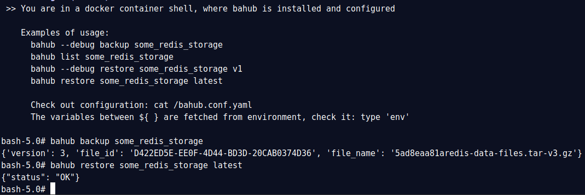

Bahub API client
================

Bahub is an automation tool for uploading and restoring backups.
Works in shell, can work as a docker container in the same network with scheduled automatic backups of other containers, or can work
as an UNIX daemon on the server without containerization.

