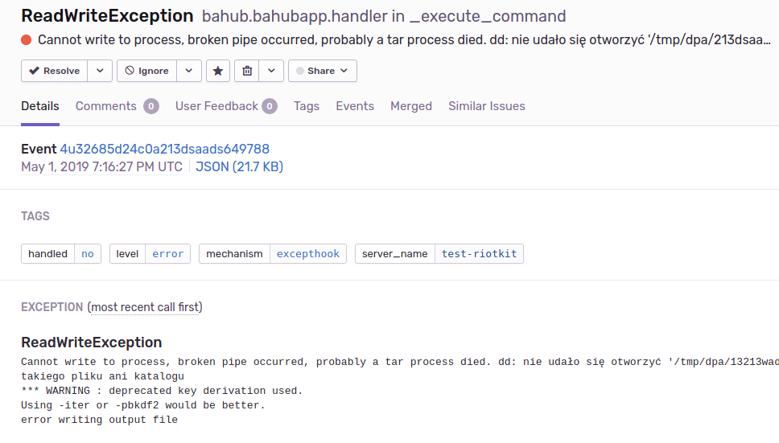
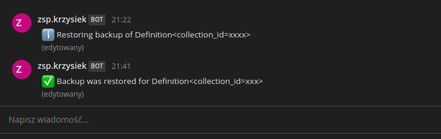

Monitoring errors with Sentry
=============================

Bahub uses shell commands to take some data, pack it and encrypt. What if any of those commands will fail?
What if there are no enough permissions? What if the directory does not exist? All of those are good reasons
to have set up a monitoring.

Almost each application failure can be catched and sent to analysis. Don't worry about the privacy, you can use your
own Sentry instance.

To enable the monitoring you need to have a ready-to-use Sentry instance/account and a error_handler configured in Bahub.

.. code:: yaml

    error_handlers:
        remote_sentry:   # name it as you want
            type: sentry
            url: "https://some-url"

Notifications
=============

Each event such as upload success, restore success, or a failure can emit a notification.

.. code:: yaml

    notifiers:
        mattermost:     # name it as you want
            type: slack # compatible with Slack and Mattermost
            url: "https://xxxxx"
