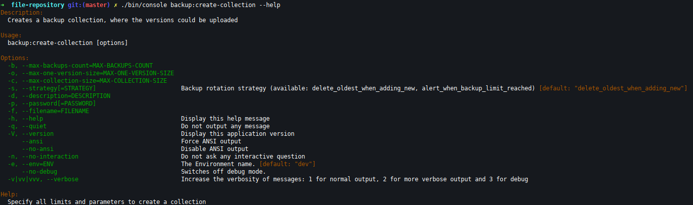

Managing collections from shell
===============================

To allow automating things there are shell commands, those do not require authorization and have the same parameters
as API endpoints.

Creating collections
--------------------

The command will return just a collection id on success. On failure a json is returned.

Example success output:

.. code:: bash

    ✗ ./bin/console backup:create-collection -d "Some test collection" -f "backup.tar.gz" -b 4 -o 3GB -c 15GB
    48449389-E267-497E-A6F4-EAC91C063708

Example failure output:

.. code:: json

    ✗ ./bin/console backup:create-collection -d "Some test collection" -f "backup.tar.gz" -b 4 -o 3GB -c 1GB
    {
        "status": "Logic validation error",
        "error_code": 4003,
        "http_code": 400,
        "errors": {
            "maxCollectionSize": "max_collection_size_is_lower_than_single_element_size"
        },
        "collection": null,
        "context": []
    }

*Note: Use --id parameter to assign custom id for the collection. Helpful in deployment automation.*
*Note: Use --ignore-error-if-token-exists in scripts*
