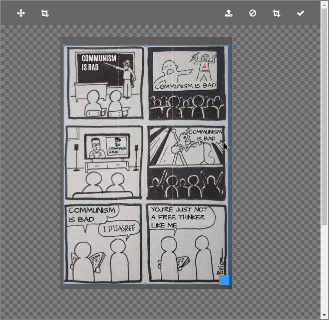
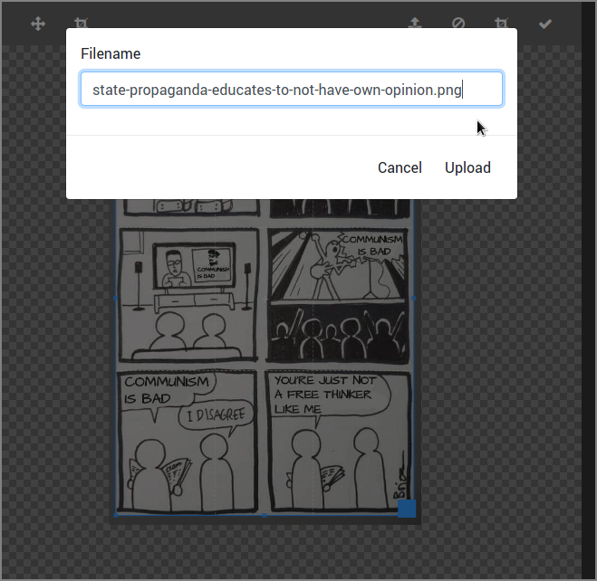
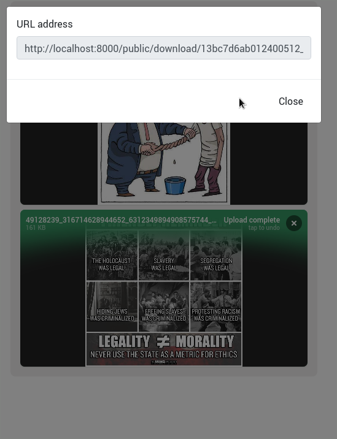
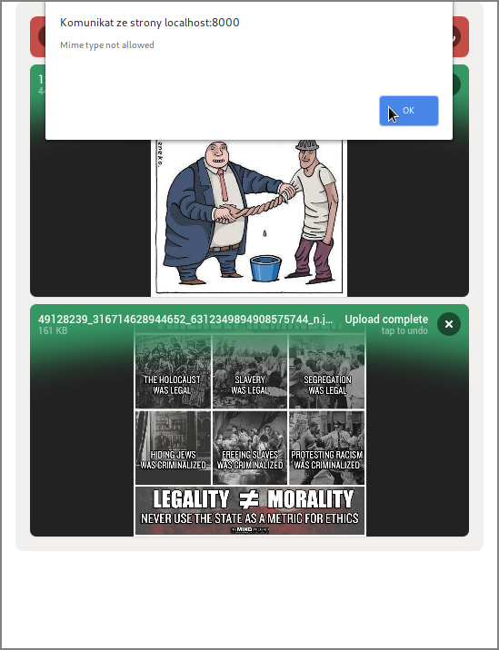
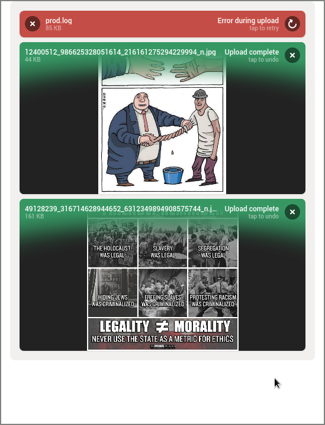

Endpoints
=========

Following endpoints are just displaying a static HTML page, that acts as a client to the API.
No any endpoint is implementing any additional access rights, if the user does not have access to perform some action, then the page would display, but
the backend will respond with an error.

If you need to restrict the file size, mime type, allowed tags or others, then you need to specify it in the access token that will be used in the UI.

======================================  ====================================================================================================================
 **Roles** used by the endpoints
------------------------------------------------------------------------------------------------------------------------------------------------------------
 name                                    description
======================================  ====================================================================================================================
upload.enforce_no_password               Enforce the file to be uploaded without a password
upload.enforce_tags_selected_in_token    Tag uploaded file with tags specified in the token, regardless of user choice
upload.images                            Upload images
======================================  ====================================================================================================================

Image Upload
------------

The image upload endpoint allows to upload whole file as is, or with cropping it.
Cropper supports an aspect ratio, that could be specified in the query string.

======================================  ====================================================================================================================
 Extra parameters in **query string**
------------------------------------------------------------------------------------------------------------------------------------------------------------
 name                                    description
======================================  ====================================================================================================================
ratio                                    Aspect ratio for the images eg. 16/9 is 1.77, so it would be ?ratio=1.77
back                                     URL address to redirect the user on success. FILE_REPOSITORY_URL phrase will be replaced with the uploaded file URL
_token                                   Access token
======================================  ====================================================================================================================

.. code:: shell

    In the browser access URL: /minimum.ui/upload/image?_token=TOKEN-THERE

File upload
-----------

File upload offers a multiple file upload, with drag & drop and fancy animations.

.. code:: shell

    In the browser access URL: /minimum.ui/upload/file?_token=TOKEN-THERE

