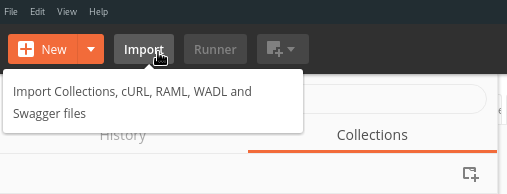
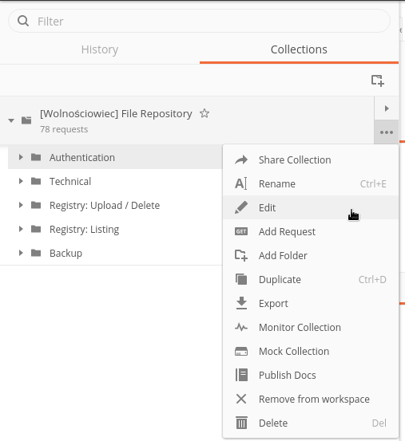
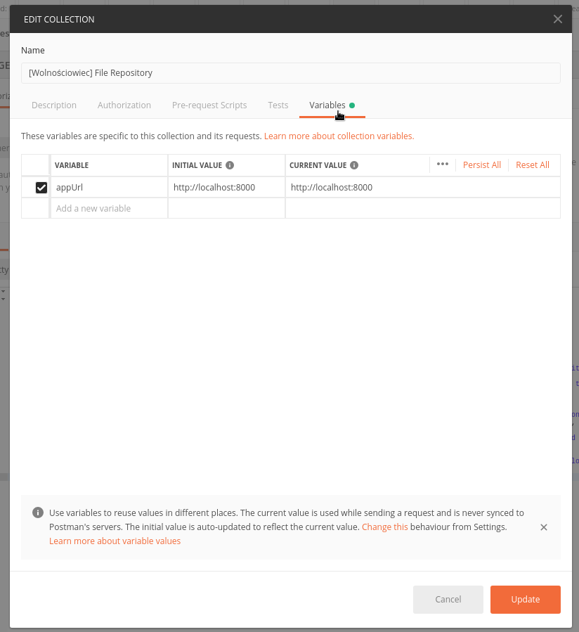
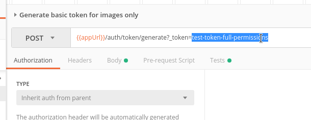

.. _postman:

Using postman to manage the application
=======================================

Postman is an API client that allowing to send HTTP requests.
You can use it, when you do not have any other graphical application, that could be acting as a client of the File Repository.

