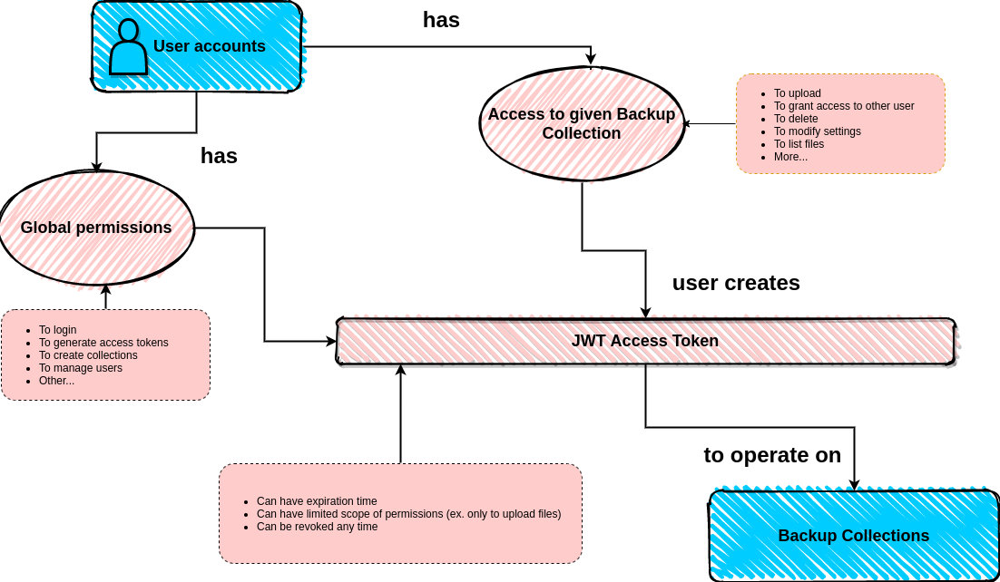
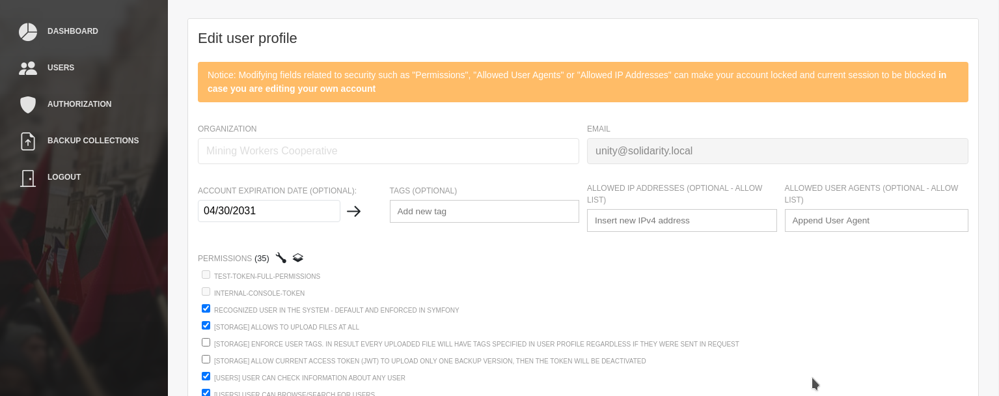
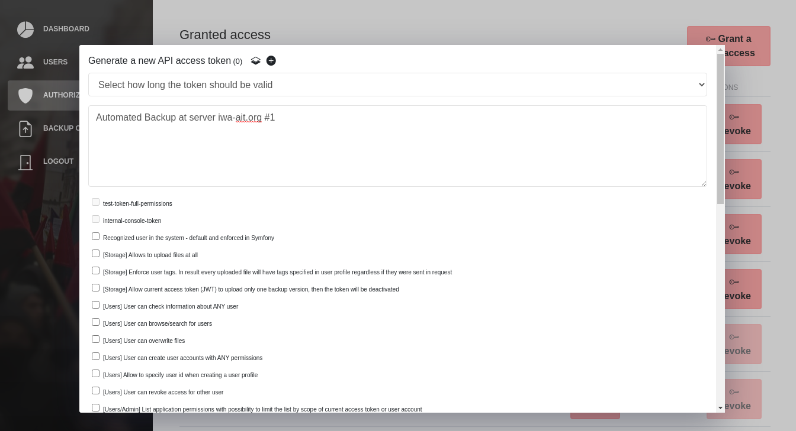
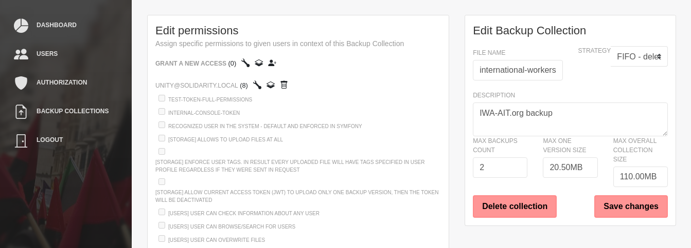

Concepts
########

Access rights
*************

The system has User Accounts and JWT Access Tokens. User can access the system only using generated JWT access token or administrator shell console.
Each JWT token is limited by global user account permissions. Additionally the JWT could have defined a scope of permissions when it is generated - it means a user can generate a self access token that will have only few permissions, not all available.

User profile "Global permissions"
---------------------------------

In user profile there is a list of permissions called "Global permissions", if you pick "Create collections" then user will be able to create collections widely.

Optionally a user account can have defined a list of allowed IP addresses and User Agent strings, to strengthen the security.

Generated JWT with limited permissions
--------------------------------------

Each user that has a permission to create API access tokens can generate such JWT token. Additionally if any permissions are selected from the list, then the generated JWT token will be limited to only selected permissions.

Permissions in scope of a collection only
-----------------------------------------

A collection manager can specify who has access to collection, and what kind of actions are allowed for each person.

**Notice:** Only collection related permissions are available to select intentionally (non-grayed positions)

