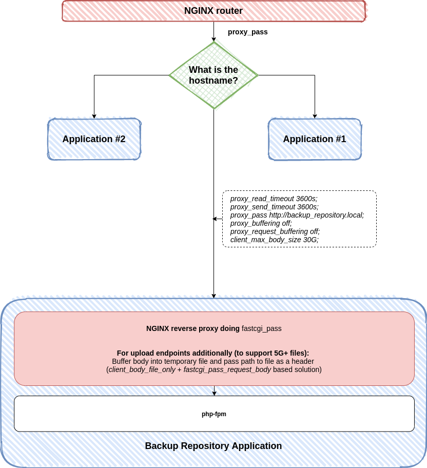

Deploying
#########

Proposed infrastructure configuration
*************************************

Backup Repository was created for a purpose of a shared hosting to store backups for non-profits that have self-managed servers all around the world.
Our infrastructure has to have higher limits and timeouts - it is a use case that should fit for almost everyone, by giving example of high scale.

1) Router at the front allows to share IP address by multiple applications
2) Separate NGINX for Backup Repository allows to have clean architecture, NGINX + PHP-FPM should be threaten as a complete application
3) Traffic between Router and Backup Repository NGINX should be without proxy buffering

.. code:: nginx

    proxy_read_timeout 3600s;
    proxy_send_timeout 3600s;
    proxy_buffering off;
    proxy_request_buffering off;
    client_max_body_size 30G;

4) Traffic between Backup Repository NGINX and PHP-FPM should be buffered
5) Traffic between Backup Repository NGINX and PHP-FPM in case of a upload endpoint :class:`^/api/stable/repository/collection/([A-Za-z0-9\-]+)/versions$` should have body buffered to temporary file and passed to application for increased performance

.. code:: nginx

    location ~ ^/api/stable/repository/collection/([A-Za-z0-9\-]+)/versions$ {
        client_body_temp_path /home/backuprepository/var/tmp;
        client_body_in_file_only   clean;
        client_body_buffer_size    1M;

        fastcgi_pass_request_body          off;
        fastcgi_pass_request_headers       on;

        include /etc/nginx/fastcgi.conf;
        fastcgi_param  X_INTERNAL_FILENAME $request_body_file;
        fastcgi_param  SCRIPT_FILENAME     $document_root/index.php;
        fastcgi_param  SCRIPT_NAME         index.php;

        fastcgi_index                      index.php;
        fastcgi_pass                       localhost:9000;

        break;
    }

