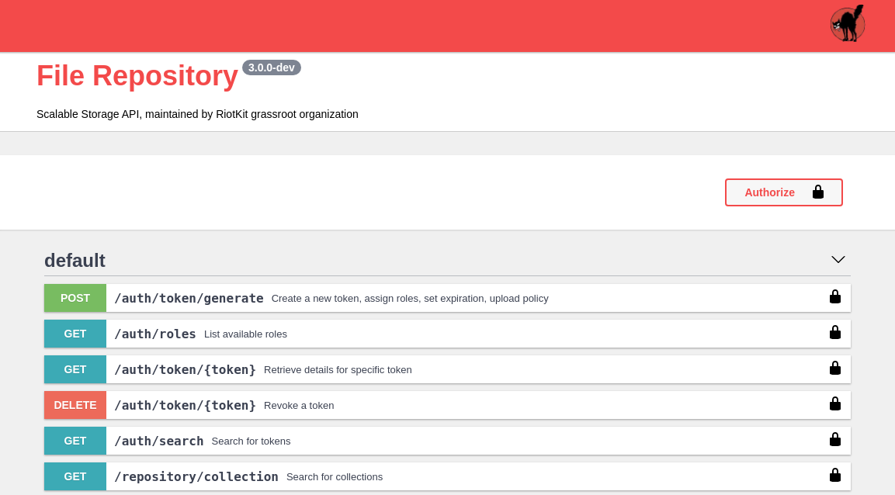

Detailed server API documentation
=================================

The docs you are browsing is user manual, it's main goal is to explain you concepts, not to list endpoints and explain their parameters.
Check out the **/api/doc** endpoint of your File Repository instance to see the swagger documentation.

